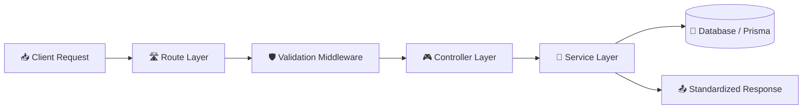
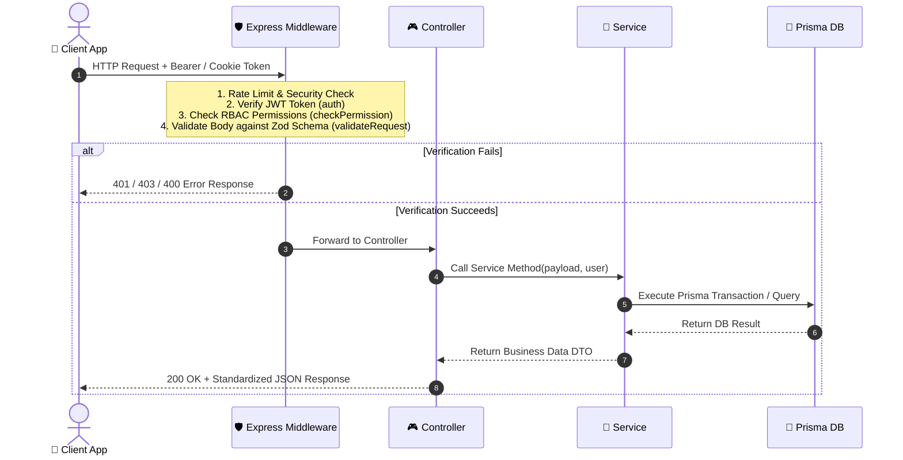
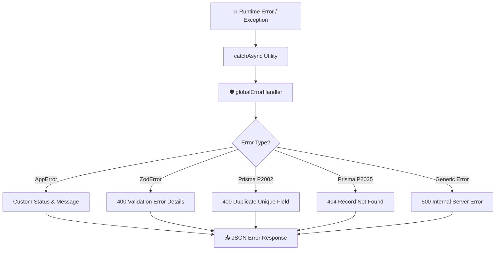

<div align="center">

# 🏛️ System Architecture Guide

### *Modular Architecture, Middleware Pipeline & Design Patterns in EmNex*

[](#-module-pattern)
[](https://expressjs.com)
[](https://www.prisma.io)

</div>

---

## 📌 Navigation

- [Project Folder Layout](#-project-folder-layout)
- [Module Pattern (5-File Architecture)](#-module-pattern-5-file-architecture)
- [Request & Response Pipeline](#-request--response-pipeline)
- [Middleware Architecture](#-middleware-architecture)
- [Standardized API Responses](#-standardized-api-responses)
- [Global Error Handling](#-global-error-handling)
- [Fire-and-Forget Audit Logging](#-fire-and-forget-audit-logging)

---

## 📁 Project Folder Layout

```ascii
EmNex-Backend/
├── prisma/
│   ├── migrations/              # Database schema migrations
│   └── schema/                  # Multi-file Prisma schema structure
│       ├── schema.prisma        # Datasource & generator config
│       ├── enums.prisma         # All 11 PostgreSQL enums
│       ├── organization.prisma  # Multi-tenant root entity
│       ├── user.prisma          # Authentication & credentials
│       ├── role.prisma          # Roles & system defaults
│       ├── permission.prisma    # System permission catalog
│       ├── role-permission.prisma # Junction join table
│       ├── department.prisma    # Department organizational structure
│       ├── employee.prisma      # Employee profiles & salary types
│       ├── project.prisma       # Project tracking & budgets
│       ├── task.prisma          # Task assignments & priority
│       ├── work-submission.prisma # Hours logging & approval
│       ├── payroll.prisma       # Payroll calculations & status
│       ├── payment.prisma       # Stripe payment transactions
│       └── audit-log.prisma     # System audit trail logs
├── src/
│   ├── app/
│   │   ├── config/              # Centralized env variable loader
│   │   ├── interfaces/          # TypeScript Express augmentation & types
│   │   ├── lib/                 # Third-party singletons (Prisma, Stripe, Cloudinary, etc.)
│   │   ├── middleware/          # Auth, Permission, Validation, Error handlers
│   │   ├── module/              # Feature modules (12 subdirectories)
│   │   └── templates/           # EJS HTML Email templates
│   ├── app.ts                   # Express application setup & middleware mounting
│   └── server.ts                # HTTP Server entry point & auto-seeder
└── package.json
```

---

## 🧩 Module Pattern (5-File Architecture)

Every feature inside `src/app/module/` strictly adheres to a clean, decoupled **5-File Architecture Pattern**:

```ascii
src/app/module/<feature>/
├── <feature>.route.ts         # Route declarations & middleware mounting
├── <feature>.controller.ts    # Request parsing & HTTP response formatting
├── <feature>.service.ts       # Business logic, Prisma queries & Audit logs
├── <feature>.validation.ts    # Zod schemas for request validation
└── <feature>.interface.ts     # TypeScript interfaces & DTO types
```

### Layer Responsibilities



| Layer | Primary Duty | Rules & Constraints |
| :--- | :--- | :--- |
| **Route** | Route endpoint definition & middleware attachment | Never contains inline logic. Only maps routes to controllers. |
| **Controller** | Extracts `req.user`, `req.params`, `req.body`, `req.query` | Uses `catchAsync()`. Delegates all business logic to Services. |
| **Service** | Core business calculations, DB queries, Audit logs | Throws `AppError` on violations. Never touches HTTP objects (`req`/`res`). |
| **Validation** | Zod input schema definition | Validates request payloads before reaching controllers. |
| **Interface** | TypeScript types & DTO definitions | Ensures static type safety across services and controllers. |

---

## 🔄 Request & Response Pipeline



---

## 🛡️ Middleware Architecture

### 1. Global Middleware (`app.ts`)

- `helmet()` — Protects against common web vulnerabilities (XSS, Clickjacking, MIME sniffing).
- `cors()` — Configures strict Cross-Origin Resource Sharing based on `FRONTEND_URL`.
- `express.json()` & `cookieParser()` — Parses JSON request bodies and HTTP cookies.

---

### 2. Route-Level Middleware Pipeline

```ascii
[ Request ] ──► auth() ──► checkPermission() ──► validateRequest() ──► Controller
```

> [!NOTE]
> **Authentication Middleware (`auth()`)**:
> 1. Extracts token from `Authorization` header (`Bearer <token>`) or `accessToken` cookie.
> 2. Decodes JWT payload and checks `tokenVersion` (invalidates old tokens on password changes).
> 3. Fetches fresh User record along with their active Role and Permissions.
> 4. Verifies User status (`BLOCKED`, `DELETED`) and Employee status (`TERMINATED`).
> 5. Attaches `IRequestUser` object to `req.user`.

> [!IMPORTANT]
> **Authorization Middleware (`checkPermission(...requiredPermissions)`)**:
> 1. Reads `req.user.permissions`.
> 2. Verifies that user possesses **ALL** required permissions.
> 3. Throws `403 Forbidden` if any permission is missing.

---

## 📤 Standardized API Responses

All API responses follow a uniform JSON structure:

### 1. Single Entity / General Response

```json
{
  "success": true,
  "statusCode": 200,
  "message": "Employee details fetched successfully",
  "data": {
    "id": "e5b8398b-7002-4648-8df0-101150cbbd1a",
    "employeeCode": "EMP-001",
    "jobTitle": "Lead Developer",
    "salaryType": "MONTHLY",
    "status": "ACTIVE"
  }
}
```

### 2. Paginated Data Response

```json
{
  "success": true,
  "statusCode": 200,
  "message": "Employees fetched successfully",
  "data": [ ... ],
  "meta": {
    "page": 1,
    "limit": 10,
    "total": 45,
    "totalPages": 5
  }
}
```

---

## 🚨 Global Error Handling

Errors thrown anywhere in the application pass through `catchAsync()` to `globalErrorHandler`.



### Standard Error Payload

```json
{
  "success": false,
  "statusCode": 400,
  "message": "Validation Error",
  "errorDetails": [
    {
      "field": "email",
      "message": "Invalid email format"
    }
  ]
}
```

---

## 📜 Fire-and-Forget Audit Logging

EmNex features an asynchronous **Audit Log Service**. Whenever a significant mutation occurs (e.g. creating employee, approving payroll, updating status), `createAuditLog()` is triggered in a non-blocking background task.

```typescript
createAuditLog({
  user: { userId: user.userId, organizationId: user.organizationId },
  action: "APPROVE_PAYROLL",
  entity: "Payroll",
  entityId: payroll.id,
  metadata: { grossAmount, netAmount },
  ipAddress: req.ip,
});
```

> [!TIP]
> Audit failures do not interrupt business execution. The logger catches errors internally and prints debug messages to console without throwing exceptions to the user.

---

[⬅️ Return to README.md](./README.md)
