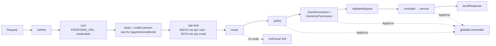
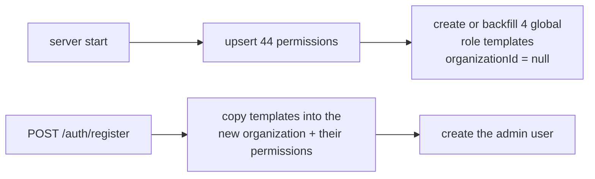

# Architecture

How the EmNex API is organized, how a request travels through it, and how authentication, permissions, errors and auditing work.

[← Back to README](./README.md)

---

## Contents

- [Layout](#layout)
- [Module pattern](#module-pattern)
- [Request pipeline](#request-pipeline)
- [Authentication](#authentication)
- [Authorization](#authorization)
- [Permission catalog](#permission-catalog)
- [Multi-tenancy](#multi-tenancy)
- [Validation](#validation)
- [Responses](#responses)
- [Error handling](#error-handling)
- [Audit log](#audit-log)
- [Seeding and role templates](#seeding-and-role-templates)
- [External services](#external-services)

---

## Layout

```text
src/
├── server.ts                 # app.listen + permission/role seed on start
├── app.ts                    # global middleware, route mounting, error handlers
├── scripts/                  # seed-demo-data.ts, migrate-own-permissions.ts
├── generated/prisma/         # Prisma client (generated, gitignored)
└── app/
    ├── config/index.ts       # typed access to process.env
    ├── interfaces/index.ts   # IRequestUser + Express Request augmentation
    ├── lib/                  # singletons: prisma, stripe, cloudinary, multer,
    │                         #   googleAuth, nodemailer, email
    ├── middleware/           # checkAuth, checkPermission, validateRequest,
    │                         #   globalErrorHandler, notFound
    ├── module/               # 12 feature modules (below)
    ├── templates/            # employee-welcome-email.ejs
    └── utils/                # AppError, catchAsync, sendResponse, auditLog,
                              #   jwt, seed, employeeStatus
```

**Modules:** `auth`, `organization`, `role`, `department`, `employee`, `project`, `task`, `submission`, `payroll`, `payment`, `analytics`, `audit-log`.

---

## Module pattern

Every module has the same files:

```text
module/<feature>/
├── <feature>.route.ts        # paths + middleware chain; no logic
├── <feature>.controller.ts   # reads req, calls the service, calls sendResponse
├── <feature>.service.ts      # business rules, Prisma queries, audit log
├── <feature>.validation.ts   # Zod schemas for request bodies
└── <feature>.interface.ts    # payload and query types
```

| Layer | Responsible for | Never does |
| :--- | :--- | :--- |
| Route | Path, `auth()`, permission check, `validateRequest(...)`, controller | Business logic |
| Controller | Pulling `req.user`, `req.params`, `req.body`, `req.query`; wrapping in `catchAsync`; `sendResponse` | Database access |
| Service | Every rule (ownership, status checks, self-action guards), queries, transactions, audit entries | Touching `req` / `res` |
| Validation | Shape and limits of request bodies | Database lookups |

Services throw `AppError(status, message)` for any rule violation; nothing else needs to know about HTTP.

---

## Request pipeline


```mermaid
flowchart LR
    A[Request] --> B[helmet]
    B --> C[cors<br/>FRONTEND_URL, credentials]
    C --> E[body + cookie parsers<br/>raw for /payments/webhook]
    E --> D[rate limit<br/>300/15 min per user · 20/15 min per email]
    D --> F[router]
    F --> G["auth()"]
    G --> H[checkPermission /<br/>checkAnyPermission]
    H --> I[validateRequest]
    I --> J[controller → service]
    J --> K[sendResponse]
    G -. AppError .-> X[globalErrorHandler]
    H -. AppError .-> X
    J -. AppError .-> X
    F -. no route .-> N[notFound 404]
```

The webhook route gets the **raw** body (mounted before `express.json()`) so Stripe's signature can be verified against the exact bytes.

Parsing runs **before** rate limiting so the limiters can identify the caller: signed-in requests are counted per user (from the access or refresh token), sign-in attempts per email, and only anonymous requests per IP. This matters because the frontend forwards every API call through its own server, so in production all requests arrive from the same few proxy IPs.

---

## Authentication

`auth()` (`middleware/checkAuth.ts`) runs on every protected route:

1. **Find the token** — the `accessToken` cookie first, otherwise the `Authorization` header (`Bearer <token>`).
2. **Verify** it with `JWT_ACCESS_SECRET`. The payload carries `userId`, `name`, `email`, `role` (name), `organizationId` and `tokenVersion`.
3. **Load the user fresh** with their role, the role's permissions, organization and employee record.
4. **Reject** when:
   | Condition | Status |
   | :--- | :---: |
   | No token / bad signature / expired | 401 |
   | User no longer exists | 401 |
   | `tokenVersion` differs (password was changed) | 401 |
   | User `BLOCKED` or `DELETED` | 403 |
   | Employee `TERMINATED` | 403 |
   | Role was soft-deleted | 403 |
5. **Attach** `req.user` — `{ userId, email, name, role, organizationId, permissions[] }` — and the full record as `req.account`.

Because permissions come from the database on each request (not from the token), editing a role takes effect on the user's very next request — no re-login needed.

Tokens are issued by login, register, Google sign-in and refresh, and are set as httpOnly cookies (access 24 h, refresh 7 days, `SameSite=None`, `Secure` in production) **and** returned in the response body. See [WORKFLOW.md](./WORKFLOW.md#sessions) for the full session lifecycle.

---

## Authorization

Authorization is **permission-based**: routes check permission names, never role names. The one place a role *name* matters is the content of `GET /analytics/dashboard`, which picks the admin, HR, finance or employee summary by built-in role name.

| Middleware | Passes when | Used for |
| :--- | :--- | :--- |
| `checkPermission(a, b, …)` | The user has **all** listed permissions | Most routes |
| `checkAnyPermission(a, b, …)` | The user has **at least one** | Routes that serve both "own" and "all" callers |
| `checkUserPermission(userId, p)` | (helper, called inside services) | Narrowing results once inside the service |

### Own vs. all

Where a resource has both, `x.view_own` means "my records" and `x.view` means "everyone's". The route accepts either, and the **service narrows the result** for callers who only have the `_own` variant:

```text
GET /payroll/:id   →  checkAnyPermission("payroll.view", "payroll.view_own")
                      service: if the caller lacks payroll.view and the payroll
                      isn't theirs → 403 "You can only view your own payroll"
```

The same pattern covers `GET /tasks/:id/submissions`, `PATCH /tasks/:id/status` (`task.update_own` vs `task.update`) and `GET /submissions/:id`. Dedicated `/my` endpoints (`/tasks/my`, `/submissions/my`, `/payroll/my`, `/payments/my`) require the `_own` permission and an employee record.

### Guards that permissions can't express

Some rules apply **regardless of permissions** and live in the services: no self-review or self-payment, ADMIN users can't be demoted or terminated, you can't edit your own role, and you can only grant permissions you hold. They are listed in [WORKFLOW.md](./WORKFLOW.md#cross-cutting-rules).

---

## Permission catalog

44 permissions. ✓ = granted to the built-in role by default.

| Permission | Admin | HR | Finance | Employee |
| :--- | :---: | :---: | :---: | :---: |
| `organization.view` | ✓ | ✓ | ✓ | |
| `organization.update` | ✓ | | | |
| `employee.view` / `.create` / `.update` | ✓ | ✓ | view only | |
| `employee.delete` (terminate) | ✓ | | | |
| `department.view` / `.create` / `.update` | ✓ | ✓ | | |
| `department.delete` | ✓ | | | |
| `project.view` | ✓ | ✓ | | |
| `project.create` / `.update` / `.delete` | ✓ | | | |
| `task.view` | ✓ | ✓ | | |
| `task.create` / `.assign` / `.update` / `.delete` | ✓ | | | |
| `task.view_own` / `task.update_own` | ✓ | ✓ | ✓ | ✓ |
| `submission.view` / `.approve` / `.reject` | ✓ | ✓ | | |
| `submission.view_own` / `.create` / `.update` | ✓ | ✓ | ✓ | ✓ |
| `payroll.view` / `.generate` / `.approve` / `.reject` | ✓ | | ✓ | |
| `payroll.view_own` | ✓ | ✓ | ✓ | ✓ |
| `payment.view` / `.create` | ✓ | | ✓ | |
| `payment.refund` *(reserved — not implemented)* | ✓ | | ✓ | |
| `payment.view_own` | ✓ | ✓ | ✓ | ✓ |
| `role.view` / `.create` / `.update` / `.delete` | ✓ | | | |
| `permission.view` / `permission.assign` | ✓ | | | |
| `audit.view` | ✓ | | | |
| `analytics.view` | ✓ | ✓ | ✓ | |
| **Total** | **44** | **20** | **17** | **7** |

A few routes deliberately accept a "neighbour" permission so screens work without over-granting:

| Route | Accepts | Why |
| :--- | :--- | :--- |
| `GET /employees/options` | `employee.view` **or** `task.assign` **or** `task.create` | Assignee pickers |
| `GET /projects/options` | `project.view` **or** `task.create` | Project picker on the task board |
| `GET /submissions` | `submission.view` **or** `payroll.view` **or** `payroll.generate` | Finance previews approved hours before generating payroll |
| `GET /analytics/employees·projects·payroll·payments` | `analytics.view` **or** that resource's `.view` | Stat cards are counts of data you can already see |

---

## Multi-tenancy

Every tenant-owned row carries `organizationId`, and every service query filters on `req.user.organizationId`. Loading a record from another organization by ID returns **403** ("You can only … in your organization") or **404**. Nothing in the API takes an organization ID from the client for scoping — it always comes from the verified token.

---

## Validation

`validateRequest(schema)` parses `req.body` with Zod. On success the **parsed** body replaces `req.body` (unknown fields are stripped). On failure it responds immediately:

```json
{
  "success": false,
  "statusCode": 400,
  "message": "Title must be at least 2 characters, Invalid project ID",
  "data": [
    { "field": "title", "message": "Title must be at least 2 characters" },
    { "field": "projectId", "message": "Invalid project ID" }
  ]
}
```

Rules that need the database (ownership, status, duplicates) are checked in services, not schemas.

---

## Responses

All successful responses use `sendResponse`:

```json
{
  "success": true,
  "statusCode": 200,
  "message": "Tasks fetched successfully",
  "data": [ … ],
  "meta": { "page": 1, "limit": 10, "total": 42, "totalPages": 5 }
}
```

`meta` is only present on paginated lists. Details per endpoint are in [API_INTEGRATION.md](./API_INTEGRATION.md#conventions).

---

## Error handling

Controllers are wrapped in `catchAsync`, so any thrown error reaches `globalErrorHandler`, which maps it to a status and a safe message:

| Source | Status | Message |
| :--- | :---: | :--- |
| `AppError` (business rule) | its own | its own |
| Prisma validation error | 400 | "You have provided incorrect field type or missing fields" |
| Prisma `P2002` (unique) | 400 | "Duplicate Key Error" |
| Prisma `P2003` (foreign key) | 400 | "Foreign key constraint failed" |
| Prisma `P2025` (record missing) | 400 | "An operation failed because it depends on one or more records that were required but not found." |
| Prisma `P1000` / `P1001` (DB unreachable) | 401 / 400 | Authentication failed / Can't reach database server |
| Multer upload error | 400 | "The file is too large (5 MB max)" or Multer's message |
| Anything else | 500 | the error's message |

Error body: `{ "success": false, "statusCode": <code>, "message": "<text>" }`.

Only **5xx** errors are written to the server log. 4xx are normal client outcomes (wrong password, missing refresh token for a logged-out visitor, forbidden…) and would otherwise flood the terminal.

Unknown routes return `404 { success: false, message: "Route not found", path, date }`.

---

## Audit log

`createAuditLog({ user, action, entity, entityId, metadata })` is called from services **without `await`** (25 call sites) — it never slows down or fails the request; a failed insert is caught and logged to the console. Two exceptions:

- **Resetting a role's permissions** writes its audit row inside the same transaction as the permission swap.
- **Payment events** first check whether that event is already logged, so the Stripe webhook and the success-page verify call can both run without recording the payment twice.

34 actions are recorded:

| Area | Actions |
| :--- | :--- |
| Auth | `LOGIN`, `LOGIN_FAILED`, `GOOGLE_LOGIN`, `LOGOUT`, `PASSWORD_CHANGED` |
| Employees | `CREATE_EMPLOYEE`, `UPDATE_EMPLOYEE`, `DELETE_EMPLOYEE`, `CHANGE_EMPLOYEE_ROLE`, `CHANGE_EMPLOYEE_STATUS` |
| Departments | `CREATE_DEPARTMENT`, `UPDATE_DEPARTMENT`, `DELETE_DEPARTMENT` |
| Roles | `CREATE_ROLE`, `UPDATE_ROLE`, `DELETE_ROLE`, `ASSIGN_PERMISSIONS` |
| Projects | `CREATE_PROJECT`, `UPDATE_PROJECT`, `DELETE_PROJECT`, `CHANGE_PROJECT_STATUS` |
| Tasks | `CREATE_TASK`, `ASSIGN_TASK`, `CHANGE_TASK_STATUS`, `DELETE_TASK` |
| Work hours | `SUBMIT_WORK`, `APPROVE_WORK`, `REJECT_WORK` |
| Payroll | `GENERATE_PAYROLL`, `APPROVE_PAYROLL`, `REJECT_PAYROLL` |
| Payments | `PAYMENT_INITIATED`, `PAYMENT_COMPLETED`, `PAYMENT_FAILED` |

`metadata` holds the human-readable context (names, amounts, before/after status). The `ipAddress` column exists but isn't populated yet.

---

## Seeding and role templates


```mermaid
flowchart LR
    S[server start] --> P[upsert 44 permissions]
    P --> T[create or backfill 4 global<br/>role templates<br/>organizationId = null]
    R[POST /auth/register] --> C[copy templates into the<br/>new organization + their permissions]
    C --> A[create the admin user]
```

- **Global templates** (`organizationId = null`) are the source for new organizations. They are never assigned to users.
- **Per-organization copies** are what users actually hold, so an organization can edit its HR role without affecting anyone else.
- **Reset to defaults** (`POST /roles/:roleId/reset-permissions`) replaces a built-in role's permissions with the template set in `utils/seed.ts`.
- **Data migrations** that must reach existing per-organization roles live in `src/scripts/` (e.g. `migrate-own-permissions.ts`), because the start-up seed only touches the global templates.

---

## External services

| Library file | Service | Used by |
| :--- | :--- | :--- |
| `lib/prisma.ts` | PostgreSQL via `@prisma/adapter-pg` | everything |
| `lib/stripe.ts` | Stripe | `payment` (checkout, verify, webhook) |
| `lib/cloudinary.ts` + `lib/multer.ts` | Cloudinary; in-memory upload, 5 MB, JPEG / PNG / WebP | `POST /auth/upload-avatar` |
| `lib/googleAuth.ts` | Google ID-token verification | `POST /auth/google` |
| `lib/nodemailer.ts` + `lib/email.ts` | SMTP (Gmail) + EJS template | Welcome email with temporary password |

[← Back to README](./README.md)
