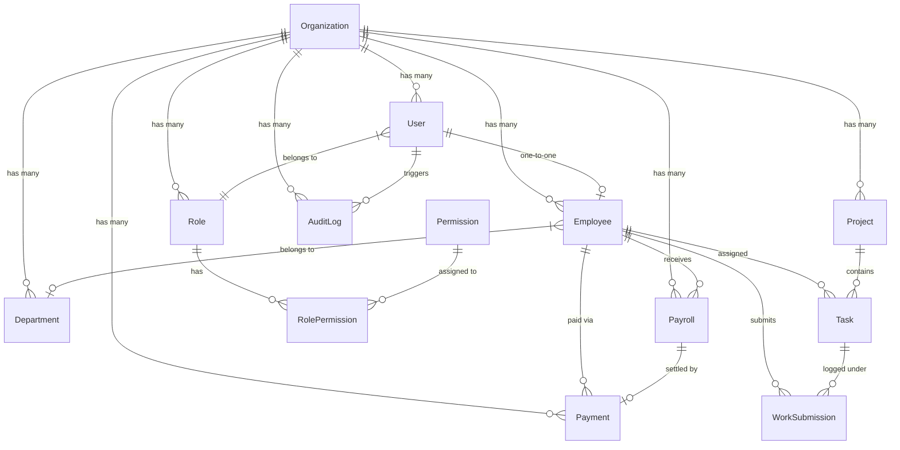

# 🐘 Database Schema & Data Models

### *PostgreSQL & Prisma 7 Relational Database Architecture*

---

## 📌 Table of Contents

- [Database Overview](#-database-overview)
- [Entity Relationship Diagram (ERD)](#-entity-relationship-diagram-erd)
- [Enum Reference Catalog](#-enum-reference-catalog)
- [Data Models Reference](#-data-models-reference)
- [Soft Delete & Retention Strategy](#-soft-delete--retention-strategy)
- [Multi-Tenant Data Scoping](#-multi-tenant-data-scoping)

---

## 📊 Database Overview

- **Engine**: PostgreSQL 16
- **ORM**: Prisma 7 (with `@prisma/adapter-pg` driver)
- **Primary Key Strategy**: UUID v4 (`@default(uuid())`)
- **Schema Management**: Multi-file split schemas (`prisma/schema/*.prisma`)
- **Total Entities**: **13 Models** | **11 Enums**

---

## 📐 Entity Relationship Diagram (ERD)

---

## 🔠 Enum Reference Catalog

| Enum Name | Defined Values | Usage / Description |
| :--- | :--- | :--- |
| `AuthProvider` | `CREDENTIAL`, `GOOGLE` | Authentication mechanism used by User |
| `UserStatus` | `ACTIVE`, `BLOCKED`, `DELETED` | Account authorization state |
| `EmployeeStatus` | `ACTIVE`, `INACTIVE`, `SUSPENDED`, `TERMINATED` | Employment lifecycle state |
| `SalaryType` | `MONTHLY`, `HOURLY` | Employee payroll calculation model |
| `ProjectStatus` | `PLANNED`, `ACTIVE`, `ON_HOLD`, `COMPLETED`, `CANCELLED` | Project lifecycle status |
| `TaskStatus` | `TODO`, `IN_PROGRESS`, `SUBMITTED`, `APPROVED`, `REJECTED`, `COMPLETED` | Individual task progress state |
| `TaskPriority` | `LOW`, `MEDIUM`, `HIGH`, `URGENT` | Urgency rating for task scheduling |
| `SubmissionStatus` | `PENDING`, `APPROVED`, `REJECTED` | Manager review state for work logs |
| `PayrollStatus` | `DRAFT`, `GENERATED`, `APPROVED`, `PROCESSING`, `PAID`, `REJECTED` | Payroll calculation & payout state |
| `PaymentGateway` | `STRIPE`, `SSLCOMMERZ`, `BKASH` | Payment processor service provider |
| `PaymentStatus` | `PENDING`, `PROCESSING`, `COMPLETED`, `FAILED`, `REFUNDED` | Financial transaction completion status |

---

## 🗄️ Data Models Reference

### 1. Organization (`organization.prisma`)
*Multi-tenant root entity. All organization data is linked to this model.*

| Field | Type | Attributes | Description |
| :--- | :--- | :--- | :--- |
| `id` | `String` | `@id @default(uuid())` | Unique Organization UUID |
| `name` | `String` | | Organization legal name |
| `slug` | `String` | `@unique` | URL-friendly unique identifier |
| `createdAt` | `DateTime` | `@default(now())` | Creation timestamp |
| `updatedAt` | `DateTime` | `@updatedAt` | Last update timestamp |

---

### 2. User (`user.prisma`)
*Authentication credentials & profile metadata.*

| Field | Type | Attributes | Description |
| :--- | :--- | :--- | :--- |
| `id` | `String` | `@id @default(uuid())` | Unique User UUID |
| `organizationId` | `String` | FK → `Organization` | Tenant scoping key |
| `name` | `String` | | Full display name |
| `email` | `String` | `@unique` | Unique login email address |
| `password` | `String?` | | Bcrypt hash (null for OAuth) |
| `avatar` | `String?` | | Cloudinary image URL |
| `googleId` | `String?` | `@unique` | Google OAuth subject ID |
| `authProvider` | `AuthProvider` | `@default(CREDENTIAL)` | Auth provider type |
| `roleId` | `String` | FK → `Role` | Assigned Role UUID |
| `status` | `UserStatus` | `@default(ACTIVE)` | Account status |
| `tokenVersion` | `Int` | `@default(0)` | Security invalidation counter |
| `createdAt` | `DateTime` | `@default(now())` | Account creation timestamp |

---

### 3. Role (`role.prisma`) & RolePermission (`role-permission.prisma`)
*Role definitions & RBAC permission join table.*

| Field | Type | Attributes | Description |
| :--- | :--- | :--- | :--- |
| `id` | `String` | `@id @default(uuid())` | Role UUID |
| `name` | `String` | | Role name (e.g. `ADMIN`, `HR_MANAGER`) |
| `isSystem` | `Boolean` | `@default(false)` | Flag for immutable system roles |
| `organizationId` | `String?` | FK → `Organization` | Tenant scoping (null for global templates) |
| `deletedAt` | `DateTime?` | | Soft delete timestamp |

---

### 4. Employee (`employee.prisma`)
*Employment details, salary configurations, and codes.*

| Field | Type | Attributes | Description |
| :--- | :--- | :--- | :--- |
| `id` | `String` | `@id @default(uuid())` | Employee UUID |
| `organizationId` | `String` | FK → `Organization` | Tenant scoping key |
| `userId` | `String` | `@unique`, FK → `User` | Linked User account |
| `departmentId` | `String?` | FK → `Department` | Belonging Department |
| `employeeCode` | `String` | | Auto code (`EMP-001`) |
| `jobTitle` | `String` | | Designated job title |
| `salaryType` | `SalaryType` | | `MONTHLY` or `HOURLY` |
| `salary` | `Decimal?` | | Fixed monthly salary amount |
| `hourlyRate` | `Decimal?` | | Hourly rate amount |
| `joiningDate` | `DateTime` | | Formal hiring date |
| `status` | `EmployeeStatus` | `@default(ACTIVE)` | Employment state |

---

### 5. Project (`project.prisma`) & Task (`task.prisma`)
*Project management and employee task assignment.*

| Field | Type | Attributes | Description |
| :--- | :--- | :--- | :--- |
| `id` | `String` | `@id @default(uuid())` | Task UUID |
| `projectId` | `String` | FK → `Project` | Parent Project UUID |
| `employeeId` | `String` | FK → `Employee` | Assigned Employee UUID |
| `title` | `String` | | Task title |
| `estimatedHours`| `Decimal?` | | Estimated completion hours |
| `priority` | `TaskPriority` | `@default(MEDIUM)` | Task priority rating |
| `status` | `TaskStatus` | `@default(TODO)` | Task progress state |
| `dueDate` | `DateTime?` | | Deadline date |

---

### 6. WorkSubmission (`work-submission.prisma`)
*Work logs submitted by employees for manager review.*

| Field | Type | Attributes | Description |
| :--- | :--- | :--- | :--- |
| `id` | `String` | `@id @default(uuid())` | WorkSubmission UUID |
| `taskId` | `String` | FK → `Task` | Target Task UUID |
| `employeeId` | `String` | FK → `Employee` | Submitting Employee UUID |
| `hoursWorked` | `Decimal` | | Number of hours spent |
| `workDate` | `DateTime` | | Date when work occurred |
| `status` | `SubmissionStatus` | `@default(PENDING)` | Review status |
| `reviewedBy` | `String?` | | Reviewer User UUID |
| `reviewNote` | `String?` | | Rejection feedback / note |

---

### 7. Payroll (`payroll.prisma`) & Payment (`payment.prisma`)
*Calculated compensation and financial transactions.*

| Field | Type | Attributes | Description |
| :--- | :--- | :--- | :--- |
| `id` | `String` | `@id @default(uuid())` | Payroll UUID |
| `employeeId` | `String` | FK → `Employee` | Target Employee UUID |
| `periodStart` | `DateTime` | | Pay period start date |
| `periodEnd` | `DateTime` | | Pay period end date |
| `grossAmount` | `Decimal` | | Calculated gross compensation |
| `deductions` | `Decimal` | `@default(0)` | Statutory / custom deductions |
| `netAmount` | `Decimal` | | Final payable amount (`gross - deductions`) |
| `status` | `PayrollStatus` | `@default(DRAFT)` | Payroll processing state |

---

## 🗑️ Soft Delete & Retention Strategy

To preserve historical audit records and payroll calculations, EmNex uses a **Soft Delete** strategy for core structural entities:

| Model | Soft Delete Field | Impact on Queries |
| :--- | :---: | :--- |
| **Role** | `deletedAt` | Excluded from role assignment queries. System roles protected. |
| **Department** | `deletedAt` | Excluded from lists. Assigned employees retain reference. |
| **Project** | `deletedAt` | Soft-deleted; blocked if active tasks are attached. |
| **Task** | `deletedAt` | Soft-deleted; blocked if submissions are linked. |

> [!IMPORTANT]
> Financial & Audit models (`WorkSubmission`, `Payroll`, `Payment`, `AuditLog`) **DO NOT** support soft deletion. They are permanent immutable system records.

---

[⬅️ Return to README.md](./README.md)
