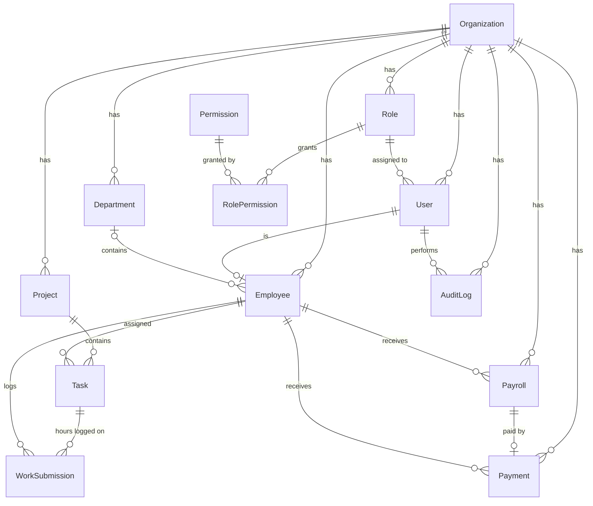

# Database

PostgreSQL schema for EmNex, managed with Prisma 7.

[← Back to README](./README.md)

---

## Contents

- [Overview](#overview)
- [Entity relationships](#entity-relationships)
- [Models](#models)
- [Enums](#enums)
- [Constraints and indexes](#constraints-and-indexes)
- [Deleting data](#deleting-data)
- [Money](#money)
- [Migrations and seeding](#migrations-and-seeding)

---

## Overview

| | |
| :--- | :--- |
| Database | PostgreSQL |
| ORM | Prisma 7 with `@prisma/adapter-pg`, `relationJoins` preview feature |
| Schema | One file per model in `prisma/schema/` |
| Client | Generated to `src/generated/prisma` (gitignored) |
| Config | `prisma7.config.ts` — pass `--config prisma7.config.ts` to every Prisma CLI command |
| Size | 13 models, 11 enums, 5 migrations |
| IDs | UUID strings (`@default(uuid())`) |

---

## Entity relationships


```mermaid
erDiagram
    Organization ||--o{ User : has
    Organization ||--o{ Role : has
    Organization ||--o{ Department : has
    Organization ||--o{ Employee : has
    Organization ||--o{ Project : has
    Organization ||--o{ Payroll : has
    Organization ||--o{ Payment : has
    Organization ||--o{ AuditLog : has

    Role ||--o{ User : "assigned to"
    Role ||--o{ RolePermission : grants
    Permission ||--o{ RolePermission : "granted by"

    User ||--o| Employee : "is"
    User ||--o{ AuditLog : performs
    Department |o--o{ Employee : contains

    Project ||--o{ Task : contains
    Employee ||--o{ Task : "assigned"
    Task ||--o{ WorkSubmission : "hours logged on"
    Employee ||--o{ WorkSubmission : logs

    Employee ||--o{ Payroll : receives
    Payroll ||--o| Payment : "paid by"
    Employee ||--o{ Payment : receives
```

**Key ideas**

- **`Organization` is the tenant root.** Every other tenant-owned table carries `organizationId` and is deleted with the organization (`onDelete: Cascade`).
- **`User` is the login, `Employee` is the job.** A user has at most one employee record (`userId` is unique). An admin who registered an organization has a user but may have no employee record — such a user can manage everything but has no "My tasks / My pay".
- **Permissions are global; roles are per organization.** `Permission` rows are shared by everyone; `RolePermission` links them to each organization's roles.

---

## Models

### Organization

| Field | Type | Notes |
| :--- | :--- | :--- |
| `id` | String | UUID |
| `name` | String | |
| `slug` | String | **unique**, chosen at registration |
| `createdAt` / `updatedAt` | DateTime | |

### User

| Field | Type | Notes |
| :--- | :--- | :--- |
| `id` | String | UUID |
| `organizationId` | String | → Organization (cascade) |
| `name` | String | |
| `email` | String | **unique across all organizations** — one email, one account |
| `password` | String? | bcrypt hash; `null` for Google-only accounts |
| `avatar` | String? | Cloudinary URL |
| `googleId` | String? | unique |
| `authProvider` | AuthProvider | `CREDENTIAL` (default) or `GOOGLE` |
| `emailVerified` | Boolean | default `false`; `true` for registered admins |
| `roleId` | String | → Role |
| `status` | UserStatus | `ACTIVE` / `BLOCKED` / `DELETED` |
| `isDeleted`, `deletedAt` | Boolean, DateTime? | `isDeleted` is checked at login and on every request |
| `isActive` | Boolean | present but unused — `status` is the source of truth |
| `mustChangePassword` | Boolean | `true` for employees created with a temporary password |
| `tokenVersion` | Int | bumped on password change to revoke all tokens |
| `createdAt` / `updatedAt` | DateTime | |

### Role · Permission · RolePermission

| Model | Field | Notes |
| :--- | :--- | :--- |
| **Role** | `name`, `description` | unique per organization (`organizationId + name`) |
| | `isSystem` | `true` for the 4 built-in roles (can't be renamed or deleted) |
| | `organizationId` | `null` = global template used to set up new organizations |
| | `deletedAt` | soft delete |
| **Permission** | `name` | unique, e.g. `task.view_own` (44 in total) |
| | `description` | optional |
| **RolePermission** | `roleId`, `permissionId` | unique pair |

### Department

| Field | Type | Notes |
| :--- | :--- | :--- |
| `organizationId` | String | cascade |
| `name` | String | unique per organization |
| `description` | String? | |
| `deletedAt` | DateTime? | soft delete |

### Employee

| Field | Type | Notes |
| :--- | :--- | :--- |
| `organizationId` | String | cascade |
| `userId` | String | **unique** → User |
| `departmentId` | String? | → Department |
| `employeeCode` | String | `EMP-001`, `EMP-002`… — unique per organization |
| `jobTitle` | String | |
| `salaryType` | SalaryType | `MONTHLY` or `HOURLY` |
| `salary` | Decimal? | monthly pay (for `MONTHLY`) |
| `hourlyRate` | Decimal? | per hour (for `HOURLY`) |
| `joiningDate` | DateTime | |
| `status` | EmployeeStatus | `ACTIVE` (default) / `INACTIVE` / `SUSPENDED` / `TERMINATED` |
| `deletedAt` | DateTime? | present but unused — employees are terminated, not deleted |

### Project

| Field | Type | Notes |
| :--- | :--- | :--- |
| `organizationId` | String | cascade |
| `name`, `description` | String, String? | |
| `startDate`, `endDate` | DateTime? | both optional; the API rejects end-before-start |
| `budget` | Decimal? | |
| `status` | ProjectStatus | default `PLANNED` |
| `deletedAt` | DateTime? | soft delete |

### Task

| Field | Type | Notes |
| :--- | :--- | :--- |
| `projectId` | String | → Project |
| `employeeId` | String | → Employee (the assignee) |
| `title`, `description` | String, String? | |
| `estimatedHours` | Decimal? | |
| `priority` | TaskPriority | default `MEDIUM` |
| `status` | TaskStatus | default `TODO` |
| `dueDate` | DateTime? | stored as UTC midnight |
| `deletedAt` | DateTime? | soft delete |

Tasks reach their organization through their project.

### WorkSubmission (work hours)

| Field | Type | Notes |
| :--- | :--- | :--- |
| `taskId` | String | → Task |
| `employeeId` | String | → Employee (who worked) |
| `description` | String | what was done (10–5000 chars) |
| `hoursWorked` | Decimal | > 0, ≤ 24 |
| `workDate` | DateTime | the day worked (not the day logged) |
| `status` | SubmissionStatus | default `PENDING` |
| `reviewedBy`, `reviewedAt` | String?, DateTime? | the reviewer's user ID and time |
| `reviewNote` | String? | rejection reason |

### Payroll

| Field | Type | Notes |
| :--- | :--- | :--- |
| `organizationId` | String | cascade |
| `employeeId` | String | → Employee |
| `periodStart`, `periodEnd` | DateTime | the pay period (normally one calendar month) |
| `grossAmount` | Decimal | base pay **+** extra amount |
| `deductions` | Decimal | default 0 |
| `netAmount` | Decimal | `grossAmount − deductions` |
| `status` | PayrollStatus | default `DRAFT` |

### Payment

| Field | Type | Notes |
| :--- | :--- | :--- |
| `organizationId` | String | cascade |
| `payrollId` | String | **unique** — one payment per payroll (retries update it) |
| `employeeId` | String | → Employee (who is paid) |
| `amount` | Decimal | the payroll's net amount |
| `currency` | String | `usd` from checkout; column default `BDT` |
| `transactionId` | String? | unique; the Stripe checkout session ID, then the payment intent ID once paid |
| `gateway` | PaymentGateway | `STRIPE` |
| `status` | PaymentStatus | default `PENDING` |

### AuditLog

| Field | Type | Notes |
| :--- | :--- | :--- |
| `organizationId` | String | cascade |
| `userId` | String | who did it |
| `action` | String | one of 34 actions, e.g. `APPROVE_PAYROLL` |
| `entity`, `entityId` | String, String? | what it was done to |
| `metadata` | Json? | names, amounts, before/after values |
| `ipAddress` | String? | not populated yet |
| `createdAt` | DateTime | |

---

## Enums

| Enum | Values | Notes |
| :--- | :--- | :--- |
| `AuthProvider` | `CREDENTIAL`, `GOOGLE` | |
| `UserStatus` | `ACTIVE`, `BLOCKED`, `DELETED` | blocked/deleted users can't log in |
| `EmployeeStatus` | `ACTIVE`, `INACTIVE`, `SUSPENDED`, `TERMINATED` | see [employee status rules](./WORKFLOW.md#employee-status) |
| `SalaryType` | `MONTHLY`, `HOURLY` | |
| `ProjectStatus` | `PLANNED`, `ACTIVE`, `ON_HOLD`, `COMPLETED`, `CANCELLED` | completed/cancelled = closed to new work |
| `TaskStatus` | `TODO`, `IN_PROGRESS`, `SUBMITTED`, `APPROVED`, `REJECTED`, `COMPLETED` | see [task flow](./WORKFLOW.md#tasks) |
| `TaskPriority` | `LOW`, `MEDIUM`, `HIGH`, `URGENT` | |
| `SubmissionStatus` | `PENDING`, `APPROVED`, `REJECTED` | |
| `PayrollStatus` | `DRAFT`, `GENERATED`, `APPROVED`, `PROCESSING`, `PAID`, `REJECTED` | the API uses `DRAFT → APPROVED → PAID` and `REJECTED`; `GENERATED` is treated like `DRAFT`; `PROCESSING` is unused |
| `PaymentGateway` | `STRIPE`, `SSLCOMMERZ`, `BKASH` | only `STRIPE` is implemented |
| `PaymentStatus` | `PENDING`, `PROCESSING`, `COMPLETED`, `FAILED`, `REFUNDED` | `REFUNDED` is reserved (refunds not implemented) |

---

## Constraints and indexes

**Unique constraints** — the rules the database enforces on its own:

| Table | Unique on | Business meaning |
| :--- | :--- | :--- |
| `organizations` | `slug` | |
| `users` | `email`, `googleId` | one account per email, platform-wide |
| `roles` | `organizationId, name` | role names are unique within an organization |
| `permissions` | `name` | |
| `role_permissions` | `roleId, permissionId` | a permission is granted once |
| `departments` | `organizationId, name` | |
| `employees` | `userId`; `organizationId, employeeCode` | one employee record per user |
| `payrolls` | `employeeId, periodStart, periodEnd` | one payroll per employee per period |
| `payments` | `payrollId`, `transactionId` | one payment per payroll |

Overlapping (not identical) payroll periods are blocked by the API, not the database.

**Indexes** cover the common filters: `organizationId` on every tenant table, plus `status` (employees, projects, tasks, submissions, payrolls, payments), `dueDate` (tasks), `entity` and `createdAt` (audit logs), and the foreign keys.

---

## Deleting data

| Model | "Delete" means | Blocked when |
| :--- | :--- | :--- |
| Department | soft delete (`deletedAt`) | it still has employees |
| Role | soft delete | it's a built-in role, or users still have it |
| Project | soft delete | it still has active tasks |
| Task | soft delete | status isn't `TODO` or `COMPLETED`, or it has work hours logged |
| Employee | status → `TERMINATED` | it's yourself or the organization admin |
| WorkSubmission, Payroll, Payment, AuditLog | never deleted | — they are the financial and audit record |

Soft-deleted rows are excluded from every list, count and analytics query (`deletedAt: null`).

**Re-creating a deleted name.** Soft-deleted departments and roles still hold their name in the `organizationId + name` unique index. Creating one with the same name **restores** the deleted row instead of failing with a duplicate-key error.

---

## Money

- Amounts are `Decimal` columns, converted to numbers in API responses.
- Payroll rounds every amount to cents, so stored `gross − deductions` always equals `net` exactly.
- Stripe is charged in the smallest currency unit: `round(netAmount × 100)`.

---

## Migrations and seeding

| Migration | Adds |
| :--- | :--- |
| `20260905114131_init` | Auth and RBAC: organizations, users, roles, permissions, role_permissions |
| `20260905123003_add_remaining_models` | Departments, employees, projects, tasks, work submissions, payrolls, payments, audit logs |
| `20260905184118_updated` | Re-creates the organization foreign keys with `ON DELETE CASCADE` |
| `20260906174520_add_soft_delete` | `deletedAt` on departments and roles |
| `20260906200521_add_token_version` | `User.tokenVersion` |

```bash
npx prisma migrate deploy --config prisma7.config.ts   # apply all migrations
npx prisma generate      --config prisma7.config.ts    # regenerate the client after schema changes
npx prisma migrate dev   --config prisma7.config.ts --name <change>   # create a new migration
```

Seeding happens in three layers — see [README → Getting started](./README.md#getting-started):

1. **Server start** — the 44 permissions and the 4 global role templates (idempotent).
2. **`npm run seed:demo`** — the "EmNex Demo" organization and its 4 demo accounts.
3. **`npx tsx src/scripts/seed-demo-data.ts`** — realistic employees, projects, tasks, hours, payroll and payments for the demo organization.

[← Back to README](./README.md)
