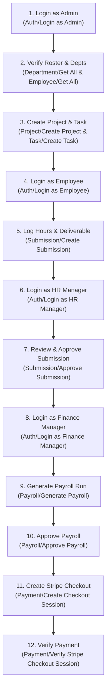

<div align="center">

# 📬 EmNex API — Postman Testing Suite & Documentation

**Comprehensive, automated Postman test collection covering all 82 endpoints of the EmNex Enterprise Workforce, Dispatch & Payroll Platform.**

[](https://www.postman.com/)
[](#endpoints-by-folder)
[](#automated-token-management)
[](https://stripe.com)

**Collection File:** [`EmNex Backend.postman_collection.json`](./EmNex%20Backend.postman_collection.json) &nbsp;·&nbsp; **Live Production API:** `https://emnex-api.vercel.app/api/v1`

</div>

---

## 📑 Contents

- [Quick Start: 1-Click Import](#quick-start-1-click-import)
- [Automated Token Management](#automated-token-management)
- [Collection Variables Reference](#collection-variables-reference)
- [4-Role Demo Authentication Matrix](#4-role-demo-authentication-matrix)
- [End-to-End Workflow Execution Runbook](#end-to-end-workflow-execution-runbook)
- [Folder & Endpoint Directory (82 Endpoints)](#folder--endpoint-directory-82-endpoints)
- [Stripe Checkout & Webhook Testing Guide](#stripe-checkout--webhook-testing-guide)
- [Status Codes & Error Reference](#status-codes--error-reference)

---

## ⚡ Quick Start: 1-Click Import

### Step 1: Import into Postman
1. Open **Postman** (Desktop or Web).
2. Click **Import** (top left).
3. Drag & drop [`EmNex Backend.postman_collection.json`](./EmNex%20Backend.postman_collection.json) or browse to select it.
4. Click **Import**. The collection **"EmNex Backend"** will appear with 14 organized folders and 82 requests.

### Step 2: Choose Your Target Environment
The collection defaults to the live production server. To test locally:
1. Select the collection **EmNex Backend** &rarr; open the **Variables** tab.
2. Change the `baseUrl` **Current Value**:
   - **Local Development:** `http://localhost:5000`
   - **Production:** `https://emnex-api.vercel.app`
3. Click **Save** (`Ctrl+S`).

---

## 🔐 Automated Token Management

> [!TIP]
> **Zero Manual Copy-Pasting Required!**  
> Every login and registration endpoint includes a Postman **Test Script** that automatically parses the response and writes your authentication tokens directly to the collection variables:

```javascript
// Automatically executed on Login / Register / Refresh
var jsonData = pm.response.json();
if (jsonData.success && jsonData.data) {
    if (jsonData.data.accessToken) {
        pm.collectionVariables.set("accessToken", jsonData.data.accessToken);
    }
    if (jsonData.data.refreshToken) {
        pm.collectionVariables.set("refreshToken", jsonData.data.refreshToken);
    }
    if (jsonData.data.user && jsonData.data.user.organizationId) {
        pm.collectionVariables.set("organizationId", jsonData.data.user.organizationId);
    }
}
```

Every subsequent request in the collection automatically references `{{accessToken}}` in its `Authorization: Bearer {{accessToken}}` header.

---

## 📊 Collection Variables Reference

| Variable | Default / Example Value | Description |
| :--- | :--- | :--- |
| `baseUrl` | `https://emnex-api.vercel.app` | Base host (without `/api/v1`) |
| `accessToken` | *Auto-populated* | JWT access token (24-hour validity) |
| `refreshToken` | *Auto-populated* | JWT refresh token (7-day validity) |
| `organizationId` | *Auto-populated* | UUID of the active corporate organization |
| `userId` | *Auto-populated* | UUID of the authenticated user |
| `employeeId` | *Auto-populated* | UUID of the employee record linked to the user |
| `roleId` | `your_role_id` | UUID of role for role-management tests |
| `departmentId` | `your_department_id` | UUID of department for staff assignment tests |
| `projectId` | `your_project_id` | UUID of project for task delegation tests |
| `taskId` | `your_task_id` | UUID of task for hour submissions |
| `submissionId` | `your_submission_id` | UUID of deliverable submission for review tests |
| `payrollId` | `your_payroll_id` | UUID of payroll batch record |
| `paymentId` | `your_payment_id` | UUID of Stripe payment record |
| `auditLogId` | `your_audit_log_id` | UUID of audit log record |
| `demoAdminEmail` | `admin@emnex.com` | Pre-seeded Admin Email |
| `demoAdminPassword` | `EmnexAdmin123!` | Pre-seeded Admin Password |

---

## 👥 4-Role Demo Authentication Matrix

The collection includes dedicated **1-Click Demo Login** requests under the **`Auth`** folder:

| Request Name | Demo Email | Demo Password | Granted Role | Primary Scope |
| :--- | :--- | :--- | :---: | :--- |
| `Login as Admin (Demo)` | `admin@emnex.com` | `EmnexAdmin123!` | **ADMIN** | Full governance: roles, departments, employees, audit logs, payroll approval |
| `Login as HR Manager (Demo)` | `manager@emnex.com` | `EmnexManager123!` | **HR_MANAGER** | Field operations: task board, deliverable reviews, employee management |
| `Login as Finance Manager (Demo)` | `finance@emnex.com` | `EmnexFinance123!` | **FINANCE_MANAGER** | Financials: payroll batch calculation, approval, and Stripe checkout |
| `Login as Employee (Demo)` | `employee@emnex.com` | `EmnexEmployee123!` | **EMPLOYEE** | Frontline execution: view own tasks, log hours, view personal payslips |

---

## 🔄 End-to-End Workflow Execution Runbook

Follow this sequence to test the entire lifecycle of the application:



### Step-by-Step Instructions:

1. **Authenticate as Admin**:  
   Execute `Auth -> Login as Admin (Demo)`. `accessToken` is saved automatically.
2. **Inspect Hierarchy**:  
   Execute `Department -> Get All Departments` and `Employee -> Get All Employees`.
3. **Dispatch a Project Task**:  
   - Execute `Project -> Create Project`. Copy the returned `id` to `{{projectId}}`.
   - Execute `Task -> Create Task` assigned to the demo employee. Copy the returned `id` to `{{taskId}}`.
4. **Switch to Employee & Submit Work**:  
   - Execute `Auth -> Login as Employee (Demo)`.
   - Execute `Task -> Get My Tasks`.
   - Execute `Submission -> Create Submission` against `{{taskId}}` with `hoursWorked: 8` and proof notes.
5. **Switch to HR Manager & Approve**:  
   - Execute `Auth -> Login as HR Manager (Demo)`.
   - Execute `Submission -> Get All Submissions (Pending)`.
   - Execute `Submission -> Approve Submission`.
6. **Switch to Finance Manager & Process Payroll**:  
   - Execute `Auth -> Login as Finance Manager (Demo)`.
   - Execute `Payroll -> Generate Payroll` for the current month.
   - Execute `Payroll -> Approve Payroll`.
   - Execute `Payment -> Create Checkout Session` &rarr; returns a live Stripe Checkout URL!
   - Execute `Payment -> Verify Stripe Checkout Session` using the returned session ID.
7. **Inspect System Audit Logs**:  
   Switch back to Admin & execute `Audit Logs -> Get All Audit Logs` to see every state change recorded with actor attribution!

---

## 📁 Folder & Endpoint Directory (82 Endpoints)

<details open>
<summary><b>1. Auth (11 Endpoints)</b></summary>

- `POST /api/v1/auth/register` — Create organization & initial admin
- `POST /api/v1/auth/login` — Sign in with email & password
- `POST /api/v1/auth/login (Login as Admin)` — 1-click admin demo login
- `POST /api/v1/auth/login (Login as HR Manager)` — 1-click HR manager demo login
- `POST /api/v1/auth/login (Login as Finance Manager)` — 1-click finance demo login
- `POST /api/v1/auth/login (Login as Employee)` — 1-click employee demo login
- `GET /api/v1/auth/me` — Current user profile, role & 44 permissions
- `POST /api/v1/auth/refresh-token` — Rotate JWT tokens
- `POST /api/v1/auth/change-password` — Change password & revoke existing sessions
- `POST /api/v1/auth/upload-avatar` — Upload avatar to Cloudinary (`multipart/form-data`)
- `POST /api/v1/auth/logout` — Invalidate session and clear cookies

</details>

<details>
<summary><b>2. Auth - Google (1 Endpoint)</b></summary>

- `POST /api/v1/auth/google` — Sign in via Google OAuth ID token

</details>

<details>
<summary><b>3. Organization (4 Endpoints)</b></summary>

- `GET /api/v1/organizations/me` — Current organization metadata & quotas
- `GET /api/v1/organizations/:id` — Get organization details by ID
- `PATCH /api/v1/organizations/:id` — Update organization settings
- `GET /api/v1/organizations/:id/stats` — High-level organization statistics

</details>

<details>
<summary><b>4. Roles & Permissions (10 Endpoints)</b></summary>

- `POST /api/v1/roles` — Create custom organization role
- `GET /api/v1/roles` — List all roles in the organization
- `GET /api/v1/roles/:id` — Get role details & granted permissions
- `PATCH /api/v1/roles/:id` — Update role name or description
- `DELETE /api/v1/roles/:id` — Soft-delete custom role
- `POST /api/v1/roles/:id/reset` — **Reset built-in role to factory default permissions**
- `GET /api/v1/roles/permissions/all` — Catalog of all 44 system permissions
- `GET /api/v1/roles/:roleId/permissions` — Get permission list of a specific role
- `POST /api/v1/roles/:roleId/permissions` — Batch assign permissions to a role
- `DELETE /api/v1/roles/:roleId/permissions/:permissionId` — Revoke permission from a role

</details>

<details>
<summary><b>5. Department (6 Endpoints)</b></summary>

- `POST /api/v1/departments` — Create new department
- `GET /api/v1/departments` — List departments with headcount
- `GET /api/v1/departments/:id` — Get department by ID
- `PATCH /api/v1/departments/:id` — Update department details or manager
- `DELETE /api/v1/departments/:id` — Soft-delete department
- `GET /api/v1/departments/:id/employees` — List department employees

</details>

<details>
<summary><b>6. Employee (7 Endpoints)</b></summary>

- `POST /api/v1/employees` — Onboard employee (generates temp password & emails credentials)
- `GET /api/v1/employees` — List employees with pagination, search, & status filters
- `GET /api/v1/employees/:id` — Employee profile with salary & department details
- `PATCH /api/v1/employees/:id` — Update job title, salary, or status
- `DELETE /api/v1/employees/:id` — Terminate employee record
- `GET /api/v1/employees/:id/stats` — Employee performance and submission stats
- `POST /api/v1/employees/:id/resend-credentials` — Re-issue temporary credentials via email

</details>

<details>
<summary><b>7. Project (7 Endpoints)</b></summary>

- `POST /api/v1/projects` — Create project with budget & timeline
- `GET /api/v1/projects` — List projects with status, search & pagination
- `GET /api/v1/projects/:id` — Project details with assigned task roster
- `PATCH /api/v1/projects/:id` — Update project budget, status, or dates
- `DELETE /api/v1/projects/:id` — Soft-delete project
- `GET /api/v1/projects/:id/tasks` — List all tasks under project
- `GET /api/v1/projects/:id/stats` — Project budget utilization & completion metrics

</details>

<details>
<summary><b>8. Task (9 Endpoints)</b></summary>

- `GET /api/v1/tasks/my` — Get tasks assigned to logged-in employee
- `POST /api/v1/tasks` — Create task with priority (Low/Med/High/Urgent)
- `GET /api/v1/tasks` — Search, filter & paginate organization tasks
- `GET /api/v1/tasks/:id` — Task details with deliverable history
- `PATCH /api/v1/tasks/:id` — Update task details
- `DELETE /api/v1/tasks/:id` — Soft-delete task
- `POST /api/v1/tasks/:id/assign` — Delegate task to an employee
- `PATCH /api/v1/tasks/:id/status` — Advance status (TODO &rarr; IN_PROGRESS &rarr; COMPLETED)
- `GET /api/v1/tasks/:id/submissions` — List submissions attached to task

</details>

<details>
<summary><b>9. Submission (7 Endpoints)</b></summary>

- `GET /api/v1/submissions/my` — Employee's personal submission log
- `POST /api/v1/submissions` — Log hours worked & attach completion notes
- `GET /api/v1/submissions` — Manager review queue (filter by PENDING)
- `GET /api/v1/submissions/:id` — Submission details
- `PATCH /api/v1/submissions/:id` — Edit pending submission
- `POST /api/v1/submissions/:id/approve` — Approve hours for payroll
- `POST /api/v1/submissions/:id/reject` — Reject with required feedback note

</details>

<details>
<summary><b>10. Payroll (6 Endpoints)</b></summary>

- `GET /api/v1/payroll/my` — Employee personal payslip history
- `POST /api/v1/payroll/generate` — Batch calculate payroll for period
- `GET /api/v1/payroll` — List payroll runs with status filters
- `GET /api/v1/payroll/:id` — Detailed salary breakdown (gross, extra, deductions, net)
- `POST /api/v1/payroll/:id/approve` — Authorize payroll for payout
- `POST /api/v1/payroll/:id/reject` — Reject payroll run

</details>

<details>
<summary><b>11. Payment (6 Endpoints)</b></summary>

- `POST /api/v1/payments/webhook` — Stripe webhook listener (signed with `STRIPE_WEBHOOK_SECRET`)
- `GET /api/v1/payments/my` — Employee payment records
- `POST /api/v1/payments` — Generate hosted Stripe Checkout session URL
- `GET /api/v1/payments` — List organization payment transactions
- `GET /api/v1/payments/:id` — Payment transaction details
- `GET /api/v1/payments/verify/:sessionId` — **Verify Stripe checkout session upon return**

</details>

<details>
<summary><b>12. Analytics (5 Endpoints)</b></summary>

- `GET /api/v1/analytics/dashboard` — Dynamic role-tailored dashboard metrics
- `GET /api/v1/analytics/employees` — Workforce headcount & salary metrics
- `GET /api/v1/analytics/projects` — Project budget health & completion rates
- `GET /api/v1/analytics/payroll` — Historical payroll cashflow trends
- `GET /api/v1/analytics/payments` — Payment settlement volume & failure rates

</details>

<details>
<summary><b>13. Audit Logs (2 Endpoints)</b></summary>

- `GET /api/v1/audit-logs` — Searchable, filterable audit trail across 34 action types
- `GET /api/v1/audit-logs/:id` — Individual audit record with actor & delta states

</details>

<details>
<summary><b>14. System (1 Endpoint)</b></summary>

- `GET /` — API health check & version ping

</details>

---

## 💳 Stripe Checkout & Webhook Testing Guide

### 1. Generating a Payment Session
Send `POST /api/v1/payments` with:
```json
{
  "payrollId": "{{payrollId}}"
}
```
The response provides a hosted `checkoutUrl`:
```json
{
  "success": true,
  "statusCode": 200,
  "data": {
    "checkoutUrl": "https://checkout.stripe.com/c/pay/cs_test_..."
  }
}
```

### 2. Testing Stripe Return
Open the `checkoutUrl` in your browser. Complete the payment using Stripe test card:
- **Card:** `4242 4242 4242 4242`
- **Expires:** Any future month/year (e.g., `12/28`)
- **CVC:** `123`
- **Postal Code:** `90210`

Upon completion, Stripe redirects to `${APP_URL}/payment/success?session_id=cs_test_...`.
In Postman, verify the session by running:
`GET /api/v1/payments/verify/cs_test_...`

---

## 🚨 Status Codes & Error Reference

All responses conform to the standard EmNex API envelope:

```json
{
  "success": false,
  "statusCode": 403,
  "message": "Cannot approve your own submission"
}
```

| Code | Meaning | Common Triggers |
| :---: | :--- | :--- |
| **`200`** | OK | Successful GET, PATCH, DELETE operations |
| **`201`** | Created | Successful entity creation (register, project, task, employee) |
| **`400`** | Bad Request | Schema validation failure, negative hours, invalid state transition |
| **`401`** | Unauthorized | Missing or expired JWT, invalid credentials, revoked token |
| **`403`** | Forbidden | Missing required permission, self-action violation, unauthorized tenant |
| **`404`** | Not Found | Entity UUID not found, or unregistered route path |
| **`409`** | Conflict | Duplicate email, duplicate payroll run for period, already paid |
| **`429`** | Too Many Requests | Rate limit exceeded (300 req / 15 min per user; 20 / 15 min for auth) |
| **`500`** | Internal Server Error | Unhandled database or server exception |
