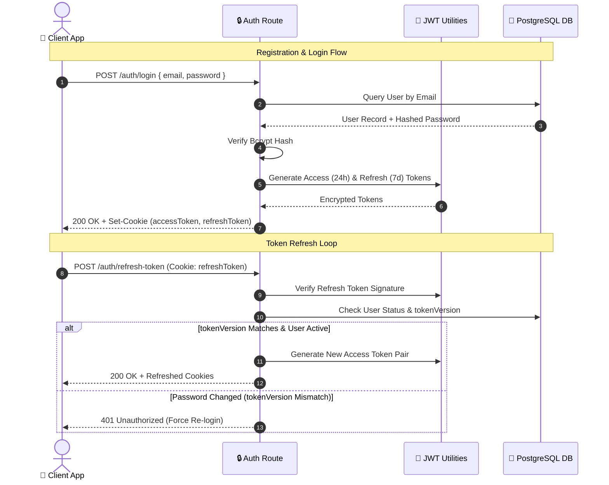
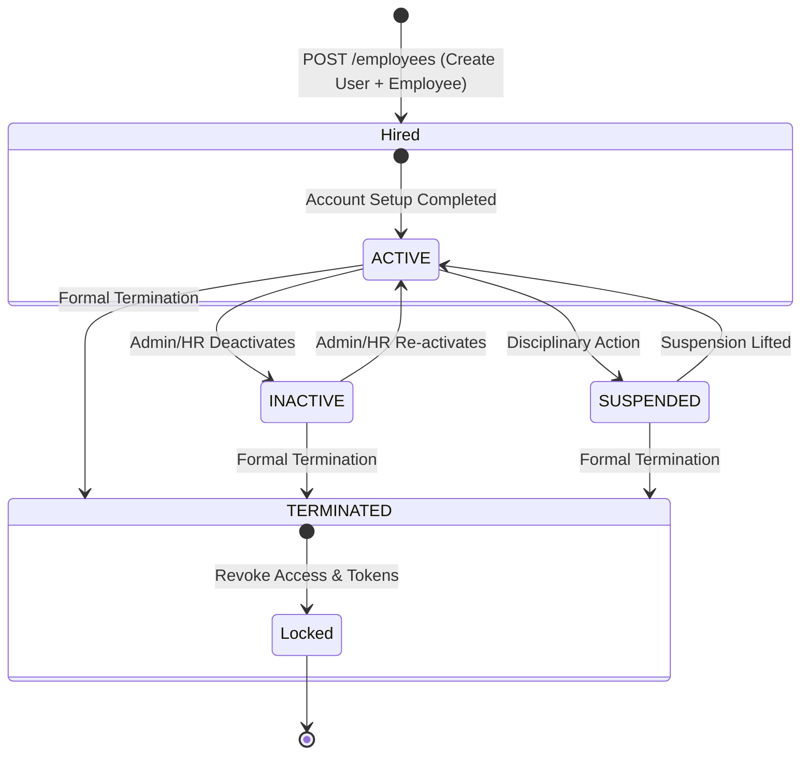
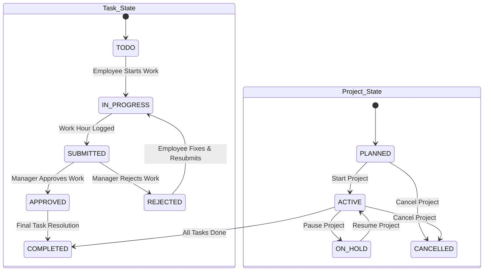
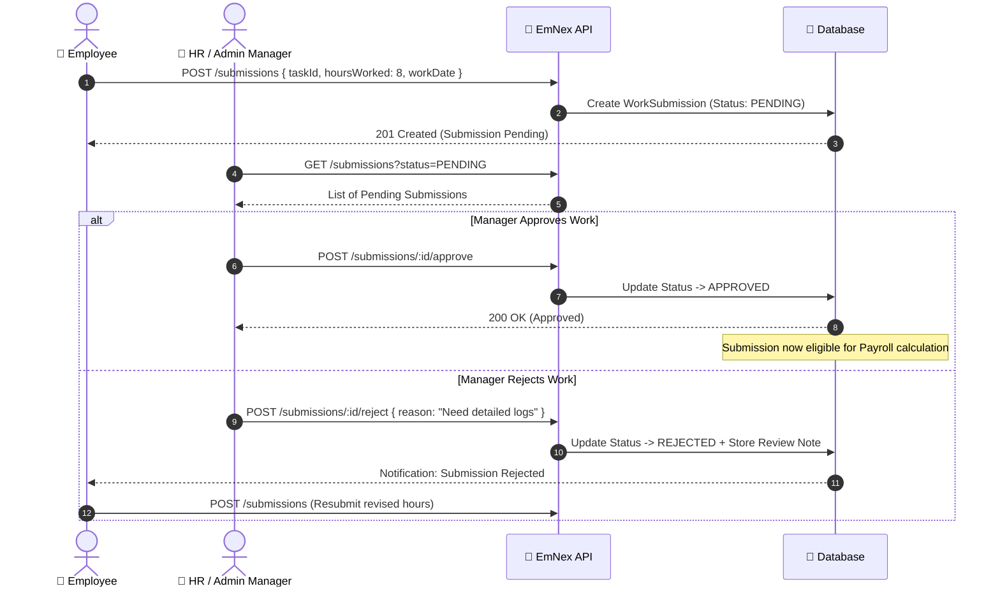
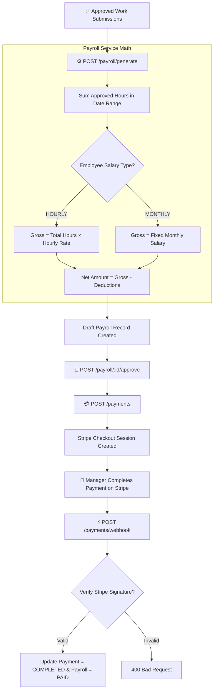
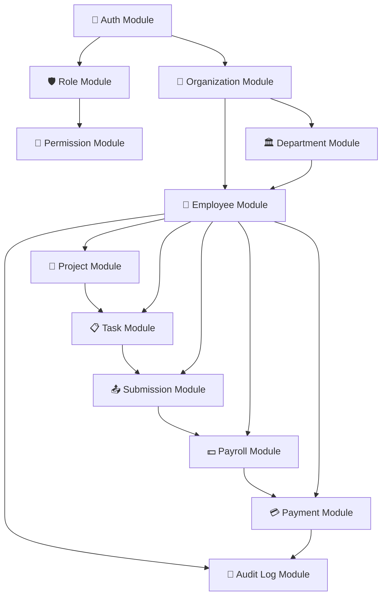

<div align="center">

# 🔄 System Workflows & Data Pipelines

### *State Machines, Financial Pipelines & Authentication Lifecycle Diagrams*

[](#-authentication--token-lifecycle)
[](https://mermaid.js.org)

</div>

---

## 📌 Table of Contents

- [Authentication & Token Lifecycle](#-authentication--token-lifecycle)
- [Employee Lifecycle State Machine](#-employee-lifecycle-state-machine)
- [Project & Task Lifecycle](#-project--task-lifecycle)
- [Work Submission & Review Loop](#-work-submission--review-loop)
- [Automated Payroll & Stripe Payment Pipeline](#-automated-payroll--stripe-payment-pipeline)
- [Permission Resolution Chain](#-permission-resolution-chain)
- [Module Dependency Graph](#-module-dependency-graph)

---

## 🔑 Authentication & Token Lifecycle

EmNex uses a dual JWT authentication model with Access (24h) and Refresh (7d) tokens stored in HTTP-only cookies.



---

## 👥 Employee Lifecycle State Machine



> [!CAUTION]
> **Admin Safeguard**: The system primary `ADMIN` account can **NEVER** be transitioned into `SUSPENDED`, `INACTIVE`, or `TERMINATED` states.

---

## 📁 Project & Task Lifecycle



---

## 📤 Work Submission & Review Loop



---

## 💵 Automated Payroll & Stripe Payment Pipeline



---

## 🛡️ Permission Resolution Chain

```mermaid
graph TD
    ClientReq[📥 Incoming Request] --> AuthMw[🔑 auth Middleware]
    AuthMw --> ExtractToken[Extract & Verify JWT]
    ExtractToken --> LoadUser[Load User + Organization + Role]
    LoadUser --> FetchPerms[Load RolePermission Join Records]
    FetchPerms --> AttachUser[Attach req.user = { userId, role, permissions }]
    
    AttachUser --> PermMw[🔐 checkPermission Middleware]
    PermMw --> PermCheck{Does req.user.permissions contain ALL required perms?}
    PermCheck -->|YES| Next[✅ Proceed to Controller]
    PermCheck -->|NO| Forbidden[❌ 403 Forbidden Response]
```

---

## 🔗 Module Dependency Graph



---

[⬅️ Return to README.md](./README.md)
