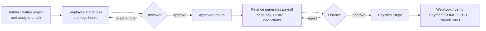
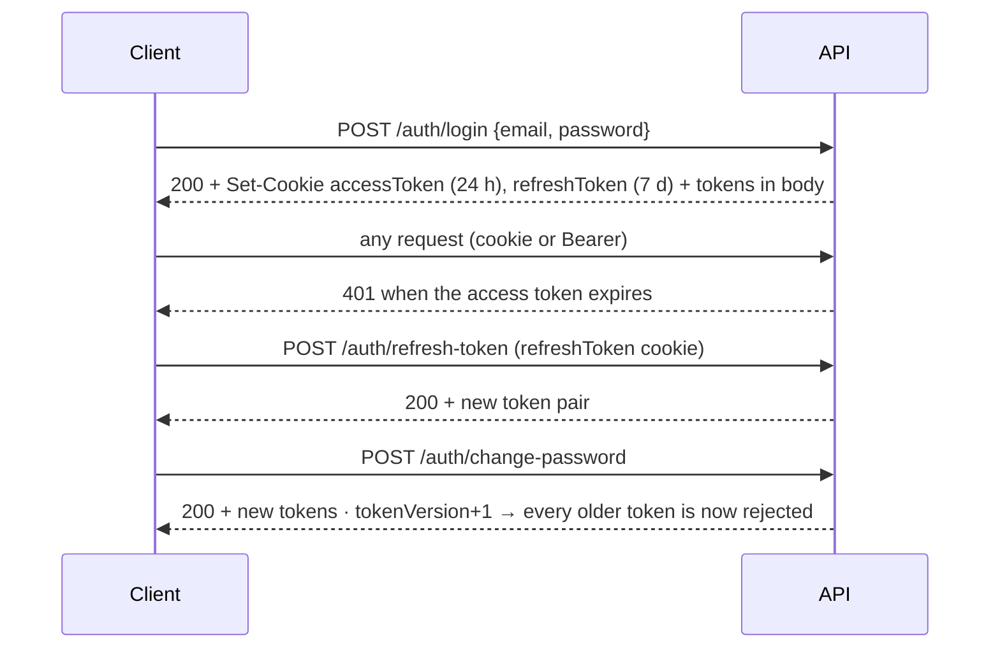
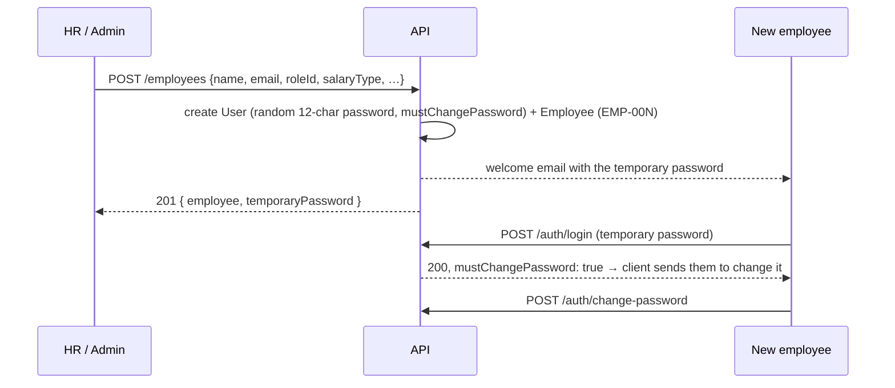
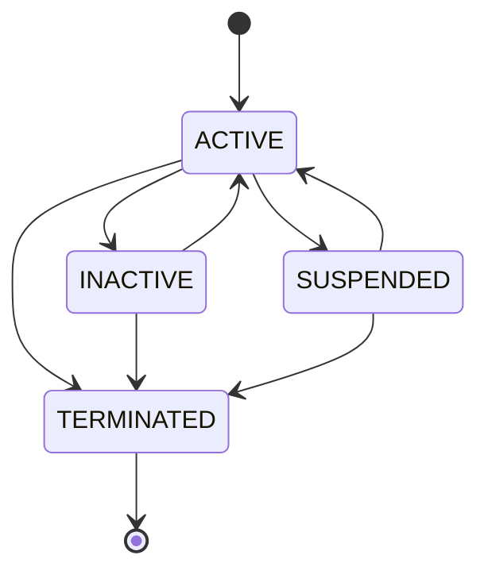
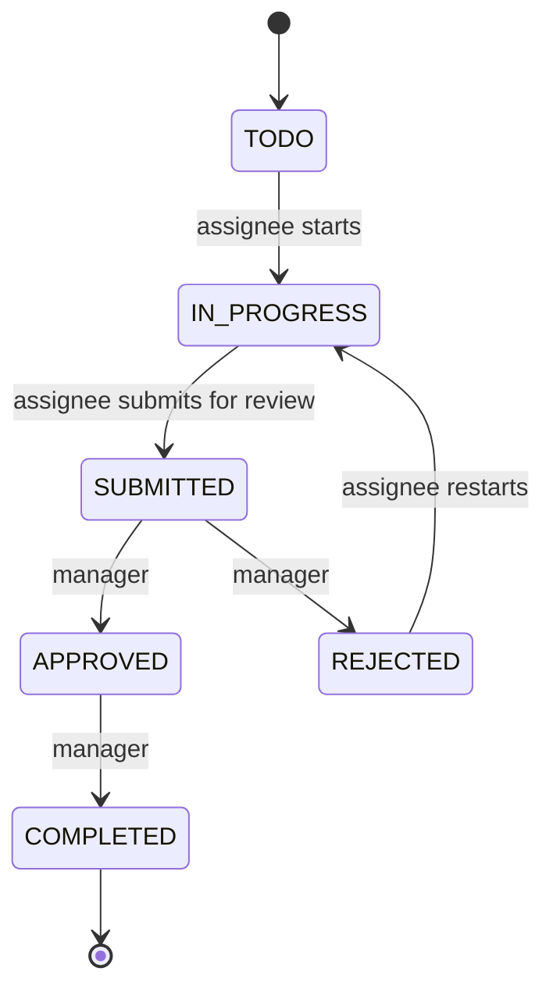
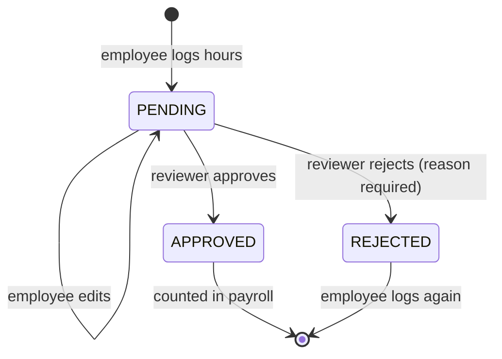
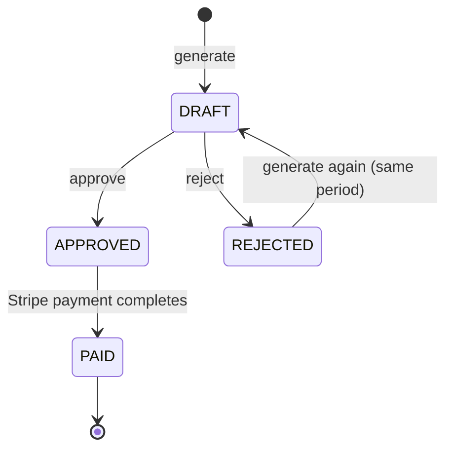
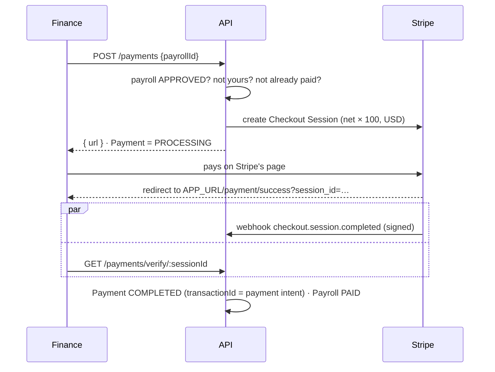

# Workflows and business rules

How work moves through EmNex — from an employee's first login to a paid salary — and every rule the API enforces along the way.

[← Back to README](./README.md)

---

## Contents

- [The big picture](#the-big-picture)
- [Sessions](#sessions)
- [Onboarding an employee](#onboarding-an-employee)
- [Employee status](#employee-status)
- [Projects](#projects)
- [Tasks](#tasks)
- [Work hours](#work-hours)
- [Payroll](#payroll)
- [Payments](#payments)
- [Roles and permissions](#roles-and-permissions)
- [Departments and organization](#departments-and-organization)
- [Cross-cutting rules](#cross-cutting-rules)

---

## The big picture


```mermaid
flowchart LR
    A[Admin creates project<br/>and assigns a task] --> B[Employee starts task<br/>and logs hours]
    B --> C{Reviewer}
    C -- approve --> D[Approved hours]
    C -- reject + note --> B
    D --> E[Finance generates payroll<br/>base pay + extra − deductions]
    E --> F{Finance}
    F -- approve --> G[Pay with Stripe]
    F -- reject --> E
    G --> H[Webhook / verify<br/>Payment COMPLETED · Payroll PAID]
```

Who does what with the built-in roles: **Admin** sets up projects and tasks; **HR** reviews work hours; **Finance** runs payroll and payments; **everyone** (including HR and Finance) can work their own tasks and see their own pay. Custom roles can mix these as needed.

---

## Sessions


```mermaid
sequenceDiagram
    participant C as Client
    participant A as API
    C->>A: POST /auth/login {email, password}
    A-->>C: 200 + Set-Cookie accessToken (24 h), refreshToken (7 d) + tokens in body
    C->>A: any request (cookie or Bearer)
    A-->>C: 401 when the access token expires
    C->>A: POST /auth/refresh-token (refreshToken cookie)
    A-->>C: 200 + new token pair
    C->>A: POST /auth/change-password
    A-->>C: 200 + new tokens · tokenVersion+1 → every older token is now rejected
```

**Login** (`POST /auth/login`)

| Situation | Result |
| :--- | :--- |
| Unknown email | 404 "User not found" |
| User blocked / deleted | 403 |
| Google-only account (no password) | 400 "Your account is linked with Google…" |
| Wrong password | 401 "Invalid credentials" (and a `LOGIN_FAILED` audit entry) |
| Correct password, employee **terminated** | 403 "Your account has been terminated. Please contact your administrator." — checked *after* the password so strangers can't probe account status |
| Success | 200, cookies set, `user` includes `role` and `mustChangePassword` |

**Register** (`POST /auth/register`) creates the organization, copies the four built-in roles into it, and creates the first user as **ADMIN**. Email and organization slug must be unused (409).

**Google sign-in** (`POST /auth/google`) verifies the Google ID token and signs in an **existing** user with that email (linking the Google ID on first use). It never creates accounts — people must be added by their organization first.

**Refresh** (`POST /auth/refresh-token`) reads only the `refreshToken` cookie. It fails with 401 if the cookie is missing, the token is invalid, the user is inactive, or `tokenVersion` changed.

**Change password** requires the current password, rejects reusing it, clears `mustChangePassword`, bumps `tokenVersion` (signing out every other device) and returns fresh tokens.

**Logout** clears both cookies. It doesn't revoke tokens server-side; a password change does.

---

## Onboarding an employee


```mermaid
sequenceDiagram
    participant HR as HR / Admin
    participant A as API
    participant E as New employee
    HR->>A: POST /employees {name, email, roleId, salaryType, …}
    A->>A: create User (random 12-char password, mustChangePassword) + Employee (EMP-00N)
    A-->>E: welcome email with the temporary password
    A-->>HR: 201 { employee, temporaryPassword }
    E->>A: POST /auth/login (temporary password)
    A-->>E: 200, mustChangePassword: true → client sends them to change it
    E->>A: POST /auth/change-password
```

- Requires `employee.create`. The email must be unused **platform-wide** (409).
- The role and department must belong to the organization, and **you can only assign a role whose permissions you already hold**.
- `employeeCode` is generated per organization: `EMP-001`, `EMP-002`, …
- If the email fails to send, creation still succeeds; the temporary password is in the response.
- **Resend credentials** (`POST /employees/:id/resend-credentials`, `employee.create`) generates a new temporary password, sets `mustChangePassword` again, emails it and returns it. The old password stops working.

---

## Employee status


```mermaid
stateDiagram-v2
    [*] --> ACTIVE
    ACTIVE --> INACTIVE
    INACTIVE --> ACTIVE
    ACTIVE --> SUSPENDED
    SUSPENDED --> ACTIVE
    ACTIVE --> TERMINATED
    INACTIVE --> TERMINATED
    SUSPENDED --> TERMINATED
    TERMINATED --> [*]
```

| Status | Log in | Be assigned tasks | Log hours / move own tasks | Payroll generated |
| :--- | :---: | :---: | :---: | :---: |
| `ACTIVE` | ✓ | ✓ | ✓ | ✓ |
| `INACTIVE` | ✓ | – | – | ✓ |
| `SUSPENDED` | ✓ | – | – | ✓ |
| `TERMINATED` | – | – | – | – |

An employee who isn't `ACTIVE` gets 403 "Your account is suspended. You cannot perform this action." (or the matching status) when logging hours or moving a task; assigning a task to them returns 400 "Cannot assign task to an employee with … status". Termination blocks login entirely.

**Changing status** (`PATCH /employees/:id` with `status`, `employee.update`):

- Setting `TERMINATED` also requires `employee.delete`. `DELETE /employees/:id` does the same thing.
- You can't move **yourself** to `INACTIVE`, `SUSPENDED` or `TERMINATED`.
- Nobody can move a user with the **ADMIN** role to those states, or change an admin's role.
- Changing anyone's role requires `role.update`, and you can't change your own.

---

## Projects

| Rule | |
| :--- | :--- |
| Dates | Both optional; when both are set, start must not be after end |
| Status | Typically `PLANNED` → `ACTIVE` ⇄ `ON_HOLD` → `COMPLETED` / `CANCELLED`. Set with `PATCH /projects/:id`; the API doesn't enforce an order, so a project can be reopened |
| Closed projects | `COMPLETED` and `CANCELLED` projects take **no new tasks, no reassignments and no new hours** |
| Delete | Soft delete; blocked while the project has active tasks |

> [!NOTE]
> Marking a project completed doesn't yet require its tasks to be finished. Any tasks still open on a completed project can't receive hours.

---

## Tasks

### Status flow


```mermaid
stateDiagram-v2
    [*] --> TODO
    TODO --> IN_PROGRESS: assignee starts
    IN_PROGRESS --> SUBMITTED: assignee submits for review
    SUBMITTED --> APPROVED: manager
    SUBMITTED --> REJECTED: manager
    REJECTED --> IN_PROGRESS: assignee restarts
    APPROVED --> COMPLETED: manager
    COMPLETED --> [*]
```

`PATCH /tasks/:id/status` accepts `task.update_own` **or** `task.update`:

| Caller | Allowed moves |
| :--- | :--- |
| **Assignee** (`task.update_own`) | Only to `IN_PROGRESS` or `SUBMITTED`, only on their own task, and only while `ACTIVE` |
| **Manager** (`task.update`) | Any valid move above — except approving, rejecting or completing **their own** task |

Anything not on the diagram (e.g. `COMPLETED → TODO`) returns 400 "Cannot transition from X to Y". Logging hours does **not** change task status; submitting the task is a separate step.

### Creating and reassigning

`POST /tasks` (`task.create`) and `POST /tasks/:id/assign` (`task.assign`) both check that:

- the project belongs to the organization and is **open** (not completed or cancelled);
- the assignee belongs to the organization and is **`ACTIVE`**;
- the assignee's role can actually work tasks — it must hold `task.update_own` **and** `submission.create`, otherwise 400 "\<name\>'s role can't work on tasks — grant it: …". This stops tasks being handed to a role that could never act on them.

### Editing and deleting

- `PATCH /tasks/:id` (`task.update`) edits title, description, estimate, priority and due date.
- `DELETE /tasks/:id` (`task.delete`) soft-deletes, but only `TODO` or `COMPLETED` tasks with **no** work hours logged.

---

## Work hours


```mermaid
stateDiagram-v2
    [*] --> PENDING: employee logs hours
    PENDING --> PENDING: employee edits
    PENDING --> APPROVED: reviewer approves
    PENDING --> REJECTED: reviewer rejects (reason required)
    APPROVED --> [*]: counted in payroll
    REJECTED --> [*]: employee logs again
```

**Logging** (`POST /submissions`, `submission.create`) — all of these must hold:

| Rule | Error |
| :--- | :--- |
| The task is assigned to you and in your organization | 403 |
| You are `ACTIVE` | 403 |
| The task isn't `COMPLETED` | 400 "Cannot submit work for a completed task" |
| The project isn't completed or cancelled | 400 "Cannot submit work for a completed project" |
| `hoursWorked` > 0 and ≤ 24 | 400 |
| `workDate` isn't in the future (one day of slack for time zones) | 400 |
| Your total for that day stays ≤ 24 h across all logs | 400 "You've already logged N h for that day…" |
| Description is 10–5000 characters | 400 |

**Editing** (`PATCH /submissions/:id`, `submission.update`) — your own logs, and only while `PENDING`.

**Reviewing** (`submission.approve` / `submission.reject`):

- Only `PENDING` logs can be approved or rejected (a second approve returns 400).
- **You can't review your own hours**, even as an admin.
- Rejecting needs a reason of 10–500 characters; it's stored as `reviewNote` and shown to the employee.
- Only **approved** hours count toward hourly pay.

---

## Payroll

### Calculating pay

```text
base pay  = HOURLY  → (approved hours with a work date inside the period) × hourly rate
            MONTHLY → monthly salary
gross     = base pay + extra amount        (extra is optional: bonus, PTO, special payment)
net       = gross − deductions
```

All amounts are rounded to cents. The **extra amount adds to** the calculated pay — it never replaces it. An hourly employee with no approved hours can still be paid by entering an extra amount alone.

### Generating (`POST /payroll/generate`, `payroll.generate`)

| Rule | Error |
| :--- | :--- |
| `periodStart` before `periodEnd` | 400 |
| The period has already started | 400 "Cannot generate payroll for a period that hasn't started yet" |
| Employee exists in the organization and isn't terminated | 404 / 400 |
| **Not your own payroll** | 403 "Cannot generate payroll for yourself" |
| No live payroll for the same employee and period | 409 |
| No overlap with another live payroll for that employee | 409 "This period overlaps an existing payroll (…)" |
| Gross > 0 (some base pay or an extra amount) | 400 "No pay to generate for … — no approved work hours, and no extra amount added." |
| Deductions ≤ gross | 400 |

"Live" means any status except `REJECTED`. A new payroll starts as `DRAFT`.

### Status flow


```mermaid
stateDiagram-v2
    [*] --> DRAFT: generate
    DRAFT --> APPROVED: approve
    DRAFT --> REJECTED: reject
    REJECTED --> DRAFT: generate again (same period)
    APPROVED --> PAID: Stripe payment completes
    PAID --> [*]
```

- **Approve** (`payroll.approve`) and **reject** (`payroll.reject`) work only on `DRAFT` (or legacy `GENERATED`) payroll. **You can't approve your own payroll.**
- **Regenerating** a rejected period reuses the rejected row: it is recalculated and goes back to `DRAFT`.
- Employees see their own payroll at `GET /payroll/my` and can open their own payslip by ID; anyone else's returns 403.

---

## Payments


```mermaid
sequenceDiagram
    participant F as Finance
    participant A as API
    participant S as Stripe
    F->>A: POST /payments {payrollId}
    A->>A: payroll APPROVED? not yours? not already paid?
    A->>S: create Checkout Session (net × 100, USD)
    A-->>F: { url } · Payment = PROCESSING
    F->>S: pays on Stripe's page
    S-->>F: redirect to APP_URL/payment/success?session_id=…
    par
        S->>A: webhook checkout.session.completed (signed)
    and
        F->>A: GET /payments/verify/:sessionId
    end
    A->>A: Payment COMPLETED (transactionId = payment intent) · Payroll PAID
```

**Creating a checkout** (`POST /payments`, `payment.create`):

- Only `APPROVED` payroll can be paid (400), never **your own** (403), and never twice (409 "This payroll has already been paid").
- One `Payment` row per payroll. Paying again after a cancelled or failed attempt **reuses** that row, opens a new session, and expires the old session so it can't also be paid.

**Completing** — whichever arrives first, the signed **webhook** or the **verify** call from the success page, marks the payment `COMPLETED` and the payroll `PAID`. The second one sees it's already done and changes nothing, so a payment is never recorded twice.

**Failures** — `checkout.session.async_payment_failed` and `payment_intent.payment_failed` set the payment to `FAILED`. The payroll stays `APPROVED`, so Finance can simply try again.

**Webhook security** — the endpoint receives the raw body and rejects any event whose `Stripe-Signature` doesn't verify against `STRIPE_WEBHOOK_SECRET`, and any session whose metadata doesn't name a payroll.

**Viewing** — `GET /payments` (`payment.view`, filter by `status` / `employeeId`), `GET /payments/my` for the employee's own payouts.

---

## Roles and permissions

| Action | Rules |
| :--- | :--- |
| **Create role** (`role.create`) | Name unique in the organization. Every permission you grant must be one **you hold**. Granting a "manage" permission (e.g. `task.assign`) automatically adds that module's `.view`; self-service ones (`*_own`, `.view`) stand alone. |
| **Edit role** (`role.update`) | Built-in roles can't be renamed. A role that users currently have can't be renamed. |
| **Change permissions** (`permission.assign`) | Same "only what you hold" rule. **You can't change your own role's permissions.** |
| **Reset to defaults** (`POST /roles/:roleId/reset-permissions`) | Built-in roles only, not your own; restores exactly the default set. |
| **Delete role** (`role.delete`) | Soft delete. Built-in roles and roles that users still have can't be deleted. |
| **Re-create** | Creating a role with the name of a deleted one restores it. |

Users whose role is deleted are rejected with 403 until they're given another role.

---

## Departments and organization

- **Departments** (`department.*`): names are unique per organization; deleting is a soft delete, blocked while employees are assigned; re-creating a deleted name restores it.
- **Organization** (`organization.update`): name and slug can be edited; the slug must stay unique. You can only read or edit your own organization.

---

## Cross-cutting rules

**Nobody acts on their own work.** These hold regardless of permissions, even for the admin:

| You can't… | Error |
| :--- | :--- |
| approve or reject your own work hours | 403 |
| approve, reject or complete your own task | 403 |
| generate, approve or pay your own payroll | 403 |
| change your own role, or suspend / deactivate / terminate yourself | 403 |
| change, remove or reset your own role's permissions | 403 |

**No privilege escalation.** You can only grant permissions — or assign a role — that you already hold.

**Admins are protected.** A user with the ADMIN role can't be deactivated, suspended, terminated or given a different role.

**Tenant isolation.** Every record is checked against your organization; other organizations' IDs return 403 or 404.

**Nothing silently disappears.** Projects, tasks, departments and roles are soft-deleted; employees are terminated, not removed; work hours, payroll, payments and audit entries are never deleted.

[← Back to README](./README.md)
